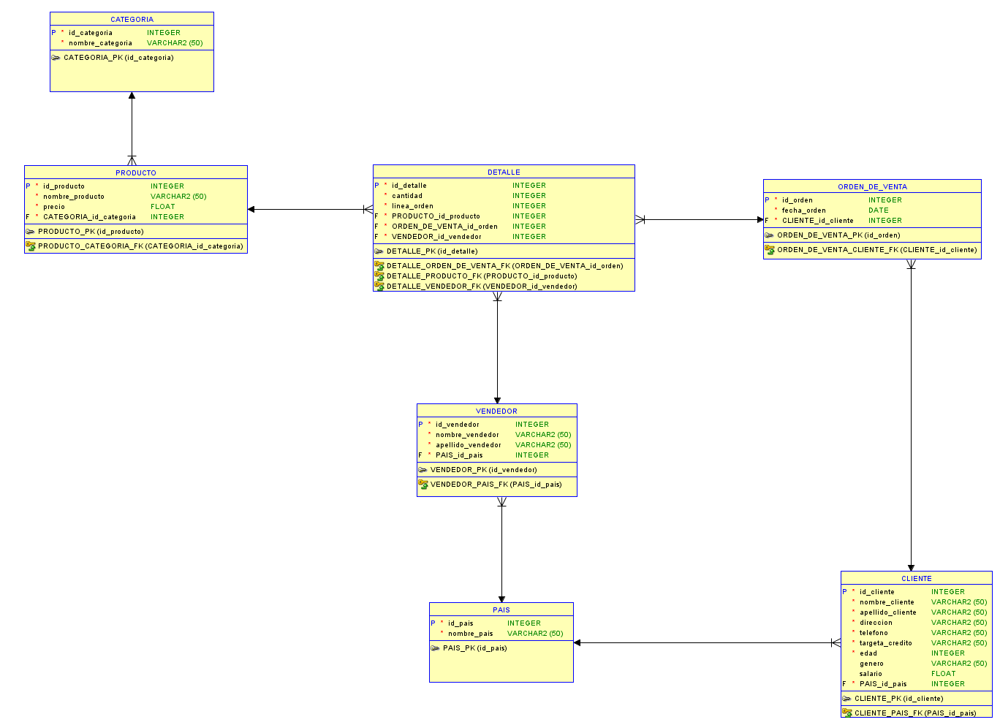
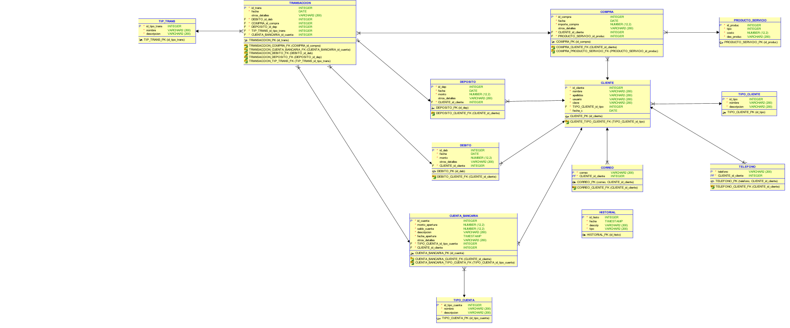

# Diseño e implementación de bases de datos relacionales

Dos sistemas de base de datos diseñados desde el modelo conceptual hasta la
implementación: esquema relacional, carga masiva de datos, procedimientos
almacenados, triggers y una API REST para consumirlos.

**Stack:** Oracle Database · SQL / PL-SQL · Python · Flask · Oracle Data Modeler

---

## Proyecto 1 — Comercio de productos

Base de datos para un emprendimiento de venta de productos, más una API REST
que la consume.

**Modelo:** 7 entidades — `cliente`, `producto`, `categoria`, `vendedor`,
`pais`, `orden_de_venta` y `detalle`, esta última resolviendo la relación
muchos-a-muchos entre órdenes y productos.

**Lo que incluye:**
- Modelado en tres niveles: conceptual, lógico y relacional
- Script DDL completo (`Proyecto1/script/Db_script.ddl`)
- Carga masiva desde CSV mediante tabla temporal de staging
- API REST en Flask (`Proyecto1/app.py`) con interfaz web
- Consultas de negocio (`Proyecto1/consultas/consultas.sql`)

### Modelo relacional



---

## Proyecto 2 — Sistema bancario

Base de datos para operaciones bancarias, con la lógica de negocio dentro del
motor en vez de en la aplicación.

**Modelo:** 13 entidades — `cuenta_bancaria`, `transaccion`, `deposito`,
`debito`, `compra`, `historial`, `producto_servicio`, `tipo_cliente`,
`tipo_cuenta`, `tip_trans`, `correo`, `telefono` y `cliente`.

**Lo que incluye:**
- Procedimientos almacenados (~26 KB) para las operaciones transaccionales
- Triggers que mantienen saldos e historial consistentes
- Modelos conceptual, lógico y relacional

### Modelo relacional



---

## Cómo ejecutarlo

La API del Proyecto 1 necesita una instancia de Oracle y sus credenciales por
variables de entorno (nunca en el código):

```bash
export DB_USERNAME="tu_usuario"
export DB_PASSWORD="tu_contraseña"
export DB_URL="localhost:1521/free"

pip install flask cx_Oracle
python Proyecto1/app.py
```

---

## Contexto

Proyectos del laboratorio de Sistemas de Bases de Datos 1, Ingeniería en
Ciencias y Sistemas — Universidad de San Carlos de Guatemala.
